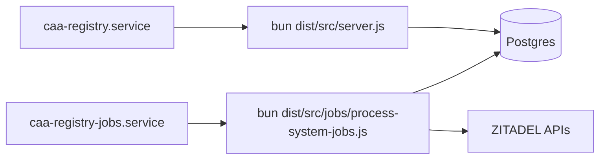
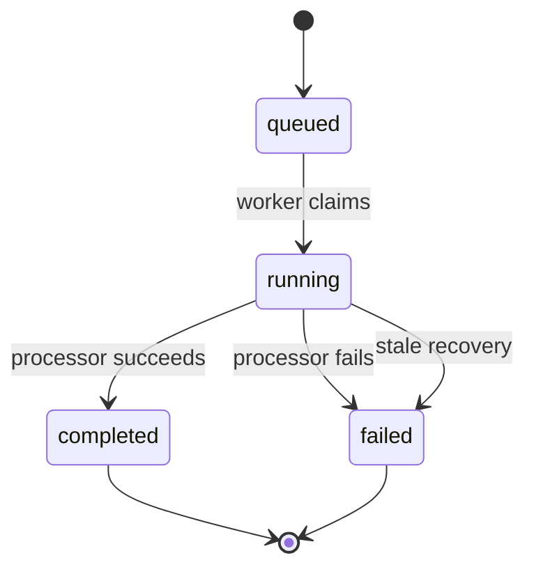
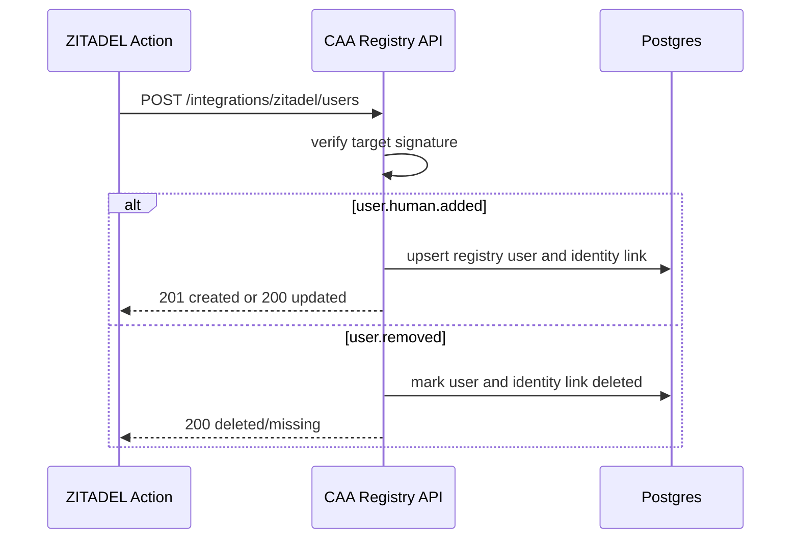
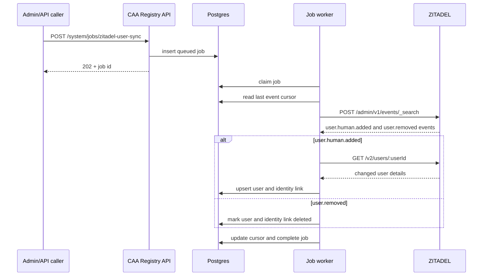
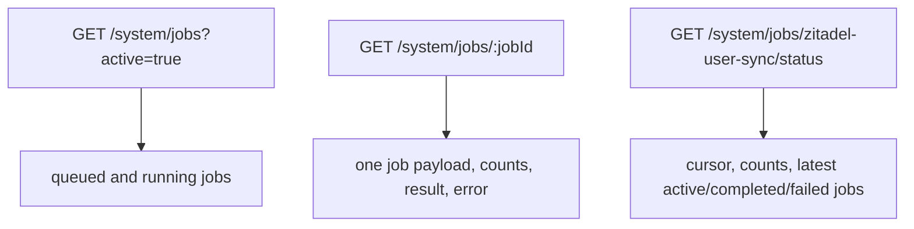

# System Jobs

CAA Registry uses database-backed system jobs for backend work that must survive
HTTP request failures, worker restarts, and missed external callbacks.

The first system job is ZITADEL user reconciliation. It repairs missed
`user.human.added` and `user.removed` action calls without scanning all ZITADEL
users on every run. Direct ZITADEL callbacks remain the live path; the job is
the durable repair path.

## Runtime Shape



The API process queues jobs. The worker process claims and runs jobs. They
coordinate through Postgres.

## Tables

| Table | Purpose |
| --- | --- |
| `system_jobs` | Durable queue rows and job results. |
| `system_job_state` | Durable cursors such as the last processed ZITADEL event sequence. |

`system_jobs.status` follows this lifecycle:



The worker claims jobs with `FOR UPDATE SKIP LOCKED`, so multiple workers can
run without processing the same row.

## ZITADEL User Sync

Live user creation and deletion use a ZITADEL Action target:



The system job is the repair path:



Default mode is `events`. It reads only new ZITADEL user lifecycle events since
the last stored cursor. Creation events fetch that specific user by ID. Removal
events soft-mark the existing registry user and identity link as deleted.

Operators can inspect queue state through the API:



`full_scan` mode exists for explicit backfills and audits. It calls
`POST /v2/users`, paginates through human users up to the configured limit, and
upserts each returned user. Do not use `full_scan` as the normal scheduled sync
path.

## Environment

| Variable | Required | Purpose |
| --- | --- | --- |
| `ZITADEL_API_TOKEN` | Yes for jobs | Service-account PAT with permission to read ZITADEL events and users. |
| `ZITADEL_API_BASE_URL` | No | Defaults to `ZITADEL_ISSUER_URL`. |
| `ZITADEL_USER_SYNC_PAGE_SIZE` | No | Event/user page size. Default `100`. |
| `ZITADEL_USER_SYNC_MAX_USERS` | No | Full-scan safety cap. Default `1000`. |
| `SYSTEM_JOB_WORKER_POLL_INTERVAL_MS` | No | Idle worker poll interval. Default `2000`. |
| `SYSTEM_JOB_STALE_RUNNING_MS` | No | Running-job timeout. Default `7200000`. |

The ZITADEL token must be a service-account token. For event API access, the
service account also needs an administrator role that can read ZITADEL events.

## Worker Service

Production should run the worker separately from the API:

```ini
[Unit]
Description=CAA Registry System Job Worker
After=network-online.target
Wants=network-online.target

[Service]
Type=simple
User=root
Group=root
WorkingDirectory=/var/www/caa-registry
EnvironmentFile=/var/www/caa-registry/.env
ExecStart=/root/.bun/bin/bun dist/src/jobs/process-system-jobs.js
Restart=always
RestartSec=5

[Install]
WantedBy=multi-user.target
```

The worker command is:

```bash
bun run jobs:start
```

For local development:

```bash
bun run jobs:work
```
